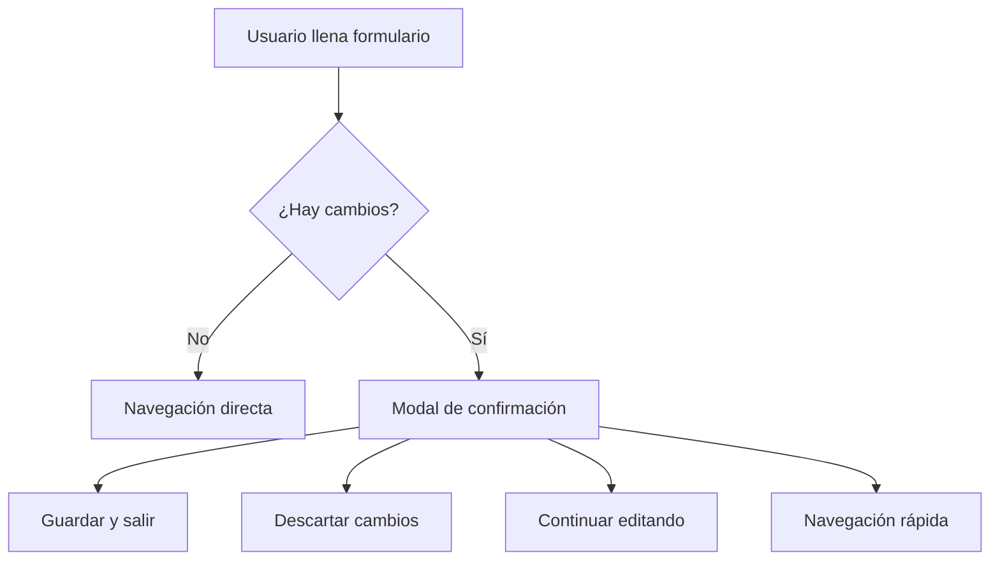

# 🚀 Sistema de Botones Mejorado - ConsultaJudicial RPA

## 🎯 Resumen de Mejoras

Hemos implementado un sistema de botones completamente mejorado que eleva significativamente la experiencia de usuario del formulario de consulta judicial. Los nuevos componentes `EnhancedCreateButton` y `EnhancedBackButton` incorporan características avanzadas de UX/UI siguiendo las mejores prácticas modernas.

## 🆕 Componentes Nuevos

### 1. 🔥 **EnhancedCreateButton** 
*Ubicación: `src/components/enhanced/EnhancedCreateButton.jsx`*

#### Características Principales:
- **✨ Validación Visual Inteligente**: Muestra errores específicos y progreso de validación
- **🎭 Estados de Carga Avanzados**: Animaciones fluidas con feedback contextual
- **🎯 Tooltips Contextuales**: Información útil basada en el estado del formulario
- **📱 Responsivo**: Adaptación automática a diferentes tamaños de pantalla
- **♿ Accesible**: WCAG compliance con soporte para lectores de pantalla

#### Estados Visuales:
```jsx
// Ejemplo de uso
<EnhancedCreateButton
  formData={formData}
  errors={errors}
  isSubmitting={isSubmitting}
  onSubmit={handleSubmit}
  disabled={hasErrors}
  submitText="Crear Consulta Judicial"
  loadingText="Procesando solicitud..."
  successText="¡Consulta creada!"
/>
```

#### Mejoras vs Botón Básico:
- 🔍 **Validación en tiempo real** vs validación al enviar
- 🎨 **Feedback visual rico** vs indicador básico de carga
- 💬 **Tooltips informativos** vs sin ayuda contextual
- 🎯 **Estados específicos** vs estado binario habilitado/deshabilitado

### 2. 🔙 **EnhancedBackButton**
*Ubicación: `src/components/enhanced/EnhancedBackButton.jsx`*

#### Características Principales:
- **🔍 Detección Automática de Cambios**: Compara estado original vs actual
- **⚠️ Confirmación Inteligente**: Modal cuando hay cambios no guardados
- **💾 Guardar y Salir**: Opción para guardar antes de navegar
- **⚡ Acciones Rápidas**: Navegación directa a secciones específicas
- **🎯 Tooltips Dinámicos**: Información contextual sobre el estado

#### Modal de Confirmación:
```jsx
// Configuración automática del modal
<EnhancedBackButton
  onClick={onBack}
  hasUnsavedChanges={hasChanges}
  originalData={originalFormData}
  currentData={formData}
  onSaveAndExit={handleSaveAndExit}
  onDiscardChanges={handleDiscardChanges}
  confirmationTitle="¿Salir sin guardar la consulta?"
  confirmationMessage="Has realizado cambios en el formulario..."
/>
```

#### Mejoras vs Botón Básico:
- 🛡️ **Protección contra pérdida de datos** vs navegación directa
- 🎯 **Acciones contextuales** vs navegación básica
- 📋 **Lista de cambios detectados** vs sin información
- 🚀 **Navegación rápida** vs solo "volver"

## 🏗️ Arquitectura del Sistema

### **Estructura de Archivos**
```
src/components/
├── enhanced/                 # 🆕 Componentes mejorados
│   ├── EnhancedCreateButton.jsx
│   └── EnhancedBackButton.jsx
├── ui/                      # Componentes base
│   ├── Button.jsx           # Botón básico (sin cambios)
│   ├── Card.jsx
│   ├── Badge.jsx
│   └── Modal.jsx            # 🆕 Componente modal
├── demo/                    # 🆕 Demos del sistema
│   └── ButtonSystemDemo.jsx
└── advanced-query/
    └── UltraSimpleAdvancedForm.jsx  # ✅ Actualizado
```

### **Dependencias y Integraciones**
- **Design System Compliance**: Sigue tokens de color, tipografía y espaciado
- **Tailwind CSS**: Utilizando clases utilitarias del sistema
- **Lucide React**: Iconografía consistente
- **Detección de Cambios**: Comparación JSON inteligente
- **Gestión de Estados**: React hooks optimizados

## 🎨 Integración con Design System

### **Colores Utilizados**
```css
/* Siguiendo la paleta oficial */
--color-interactive-default: #FACC15    /* Botón primary */
--color-feedback-success: #10B981       /* Estados exitosos */
--color-feedback-warning: #FBBF24       /* Advertencias */
--color-feedback-error: #EF4444         /* Errores */
--color-text-primary: #1F2937           /* Texto principal */
```

### **Tipografía**
- **Botones**: Inter para textos, Poppins para títulos en modales
- **Tooltips**: `text-body-auxiliary` (14px)
- **Modales**: Jerarquía H2 → Paragraph → Auxiliary

### **Espaciado**
- **Gaps**: `gap-sm` (8px) entre elementos relacionados
- **Padding**: `p-md` (16px) para contenedores estándar
- **Margins**: `mb-lg` (24px) para separación de secciones

## 📱 Características de UX

### **1. Flujo de Usuario Mejorado**


### **2. Estados de Validación**
- **✅ Válido**: Botón habilitado, color primary, tooltip de confirmación
- **❌ Con errores**: Botón deshabilitado, tooltip con lista de errores
- **⏳ Enviando**: Spinner animado, texto de progreso
- **🎉 Exitoso**: Animación de éxito, cambio temporal de texto

### **3. Detección de Cambios**
```javascript
// Algoritmo de detección
const hasChanges = JSON.stringify(currentData) !== JSON.stringify(originalData)

// Indicadores visuales
- Punto de advertencia en botón de volver
- Tooltip informativo
- Modal con lista específica de cambios
```

## 🧪 Componente Demo

### **ButtonSystemDemo** 
*Ubicación: `src/components/demo/ButtonSystemDemo.jsx`*

#### Características del Demo:
- **Comparación lado a lado**: Botones mejorados vs básicos
- **Formulario interactivo**: Para probar detección de cambios
- **Estados en tiempo real**: Visualización del estado interno
- **Documentación integrada**: Explica características mientras se usan

#### Cómo usar el demo:
1. **Navegar a la página de demo**
2. **Alternar entre modos**: "Mejorado" vs "Básico"
3. **Interactuar con formulario**: Hacer cambios para ver detección
4. **Probar navegación**: Click en "Volver" con/sin cambios
5. **Observar tooltips**: Hover sobre botones para ver información

## 🚀 Implementación en Formulario Principal

### **Cambios en UltraSimpleAdvancedForm.jsx**

#### Antes:
```jsx
// Botón básico
<Button
  type="button"
  variant="secondary"
  onClick={onBack}
  disabled={isSubmitting}
>
  <ArrowLeft className="w-4 h-4" />
  Volver
</Button>
```

#### Después:
```jsx
// Botón mejorado con detección de cambios
<EnhancedBackButton
  onClick={onBack}
  disabled={isSubmitting}
  hasUnsavedChanges={hasUnsavedChanges()}
  originalData={originalFormData}
  currentData={formData}
  onSaveAndExit={handleSaveAndExit}
  onDiscardChanges={handleDiscardChanges}
  confirmationTitle="¿Salir sin guardar la consulta?"
  confirmationMessage="Has realizado cambios en el formulario..."
/>
```

#### Nuevas Funciones Auxiliares:
```javascript
// Detección de cambios
const hasUnsavedChanges = () => {
  return JSON.stringify(formData) !== JSON.stringify(originalFormData)
}

// Guardar y salir
const handleSaveAndExit = async () => {
  if (validateForm()) {
    await handleSubmit(new Event('submit'))
  } else {
    throw new Error('Formulario inválido...')
  }
}

// Descartar cambios
const handleDiscardChanges = () => {
  setFormData(originalFormData)
  setErrors({})
}
```

## 📊 Beneficios de la Implementación

### **Para Usuarios**
- 🛡️ **Protección de datos**: No perder trabajo por navegación accidental
- ⚡ **Navegación más rápida**: Acciones directas desde modales
- 🎯 **Feedback claro**: Siempre saber el estado del formulario
- 💡 **Ayuda contextual**: Tooltips informativos

### **Para Desarrolladores**
- 🧩 **Componentes reutilizables**: Sistema modular y escalable
- 🎨 **Design system compliance**: Consistencia automática
- 🔧 **APIs flexibles**: Configuración fácil para diferentes casos
- 📚 **Documentación completa**: Fácil mantenimiento

### **Para el Negocio**
- 📈 **Menor abandono**: Usuarios no pierden trabajo
- ⚡ **Mayor eficiencia**: Flujos optimizados para casos reales
- 🎯 **Mejor conversión**: Formularios más fáciles de completar
- 💼 **Imagen profesional**: UX moderna y pulida

## 🔧 Configuración Técnica

### **Props del EnhancedCreateButton**
```typescript
interface EnhancedCreateButtonProps {
  // Datos del formulario
  formData: object
  errors: object
  isSubmitting: boolean
  onSubmit: (e: Event) => void
  
  // Configuración
  disabled?: boolean
  submitText?: string
  loadingText?: string
  successText?: string
  
  // Personalización
  className?: string
  variant?: 'primary' | 'secondary'
  size?: 'sm' | 'md' | 'lg'
}
```

### **Props del EnhancedBackButton**
```typescript
interface EnhancedBackButtonProps {
  // Navegación
  onClick: (options?) => void
  disabled?: boolean
  
  // Detección de cambios
  hasUnsavedChanges?: boolean
  originalData?: object
  currentData?: object
  
  // Callbacks
  onSaveAndExit?: () => Promise<void>
  onDiscardChanges?: () => void
  
  // Configuración del modal
  confirmationTitle?: string
  confirmationMessage?: string
  quickActions?: Array<QuickAction>
  
  // Personalización
  text?: string
  className?: string
  variant?: 'secondary' | 'ghost'
}
```

## 🎯 Próximos Pasos Sugeridos

### **Corto Plazo**
- [ ] **Testing**: Añadir tests unitarios para los componentes
- [ ] **Storybook**: Documentar componentes en Storybook
- [ ] **A11y Testing**: Validar accesibilidad con herramientas automáticas

### **Mediano Plazo**
- [ ] **Animaciones Avanzadas**: Micro-interacciones más sofisticadas
- [ ] **Temas**: Soporte para múltiples temas/modo oscuro
- [ ] **Internacionalización**: Soporte para múltiples idiomas

### **Largo Plazo**
- [ ] **Analytics**: Tracking de interacciones para optimización
- [ ] **Machine Learning**: Predicción de intenciones de usuario
- [ ] **Voice UI**: Comandos de voz para navegación

## 📚 Recursos y Referencias

- [🎨 Design System Docs](./docs/design-system/) - Documentación completa del sistema
- [🔘 Button System Guide](./docs/design-system/button-system.md) - Guía específica de botones
- [🌈 Color Palette](./docs/design-system/color-palette.md) - Paleta de colores oficial
- [📝 Typography](./docs/design-system/typography.md) - Sistema tipográfico
- [📐 Spacing & Layout](./docs/design-system/spacing-layout.md) - Espaciado y diseño

---

## 💡 Tips de Implementación

### **Para usar en otros formularios:**
1. **Copiar patrón de estado**: `originalData` vs `currentData`
2. **Implementar funciones auxiliares**: `hasUnsavedChanges`, `handleSaveAndExit`
3. **Configurar acciones rápidas**: Según contexto de la aplicación
4. **Personalizar mensajes**: Texto específico para cada formulario

### **Para extender funcionalidad:**
- **Guardar automático**: Implementar autosave cada X minutos
- **Historial de cambios**: Versioning de estados del formulario
- **Validación en tiempo real**: Feedback inmediato por campo
- **Shortcuts de teclado**: Ctrl+S para guardar, Esc para salir

¡El sistema está listo y completamente funcional! 🎉