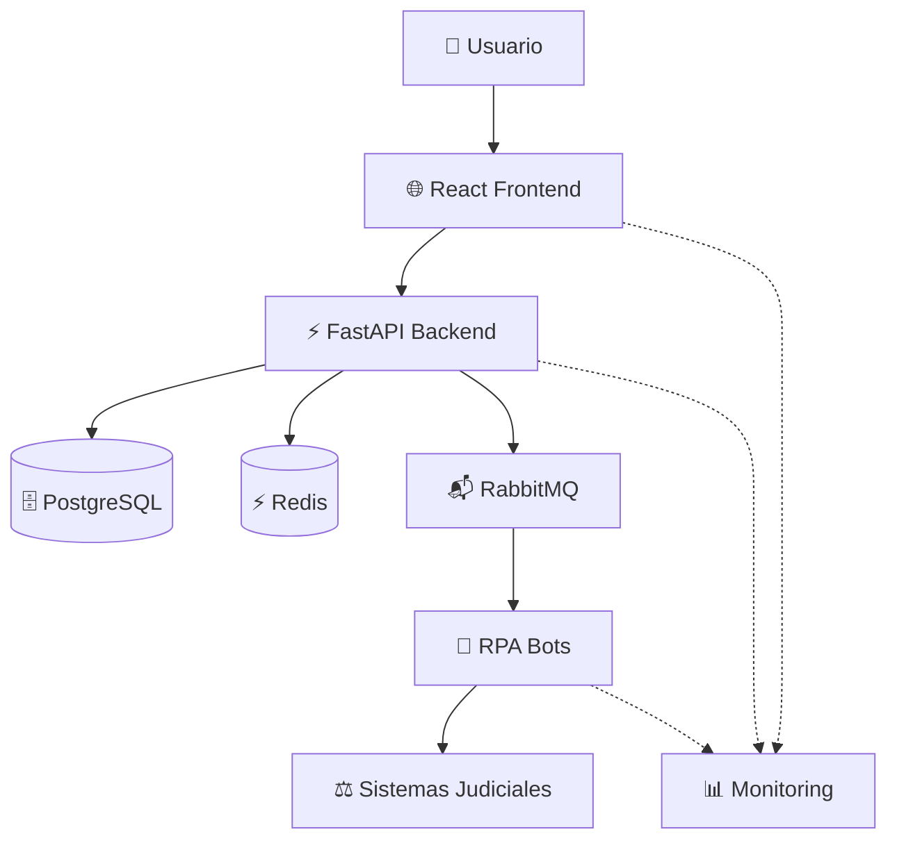

# 🚀 LEXIA - Documentación Completa

<div align="center">
  
  
  **Documentación oficial de LEXIA - Automatización Jurídica Inteligente**
  
  [](https://reactjs.org/)
  [](https://fastapi.tiangolo.com/)
  [](https://python.org/)
  [](https://docker.com/)
</div>

---

## 🎯 **¿Qué es LEXIA?**

**LEXIA** es una plataforma revolucionaria que combina **Inteligencia Artificial** y **Automatización Robótica de Procesos (RPA)** para transformar la gestión de consultas judiciales en Colombia. 

### **💡 Valor Principal**
- ⚡ **99.8% de precisión** en consultas automatizadas
- 🚀 **24/7 disponibilidad** sin intervención manual
- 📊 **Reducción del 95%** en tiempo de procesamiento
- 🛡️ **Seguridad enterprise** con cumplimiento normativo

---

## ⚡ **Quick Start por Audiencia**

<table>
<tr>
<td width="33%" align="center">

### 👩‍💻 **Desarrolladores**
¿Vas a contribuir al proyecto?

**🚀 Setup en 5 minutos**
```bash
git clone repo
docker-compose up -d
npm run dev
```

📚 **Continúa aquí:**
- [🔧 Development Setup](./getting-started/development-setup.md)
- [🏃‍♂️ Primera Contribución](./getting-started/first-contribution.md)
- [🎨 Design System](./design-system/overview.md)

</td>
<td width="33%" align="center">

### 👥 **Usuarios Finales**
¿Vas a usar LEXIA para consultas?

**📱 Primera consulta en 3 pasos**
1. Crear cuenta
2. Ingresar radicado
3. Ver resultados

📚 **Continúa aquí:**
- [📱 Onboarding](./user-guides/getting-started.md)
- [🔍 Primera Consulta](./user-guides/first-query.md)
- [📊 Interpretando Resultados](./user-guides/understanding-results.md)

</td>
<td width="33%" align="center">

### 🏢 **Administradores**
¿Vas a configurar LEXIA?

**⚙️ Setup empresarial**
1. Configurar infraestructura
2. Gestionar usuarios
3. Configurar integraciones

📚 **Continúa aquí:**
- [⚙️ Admin Setup](./getting-started/admin-setup.md)
- [🚢 Deployment](./deployment/overview.md)
- [📈 Monitoring](./deployment/monitoring.md)

</td>
</tr>
</table>

---

## 🏗️ **Arquitectura de Alto Nivel**



**Stack Tecnológico:**
- **Frontend**: React 18 + Vite + TailwindCSS
- **Backend**: Python + FastAPI + PostgreSQL
- **Automatización**: Selenium + Playwright + OpenAI
- **Infraestructura**: Docker + Kubernetes + GCP

📖 **Más detalles:** [🏗️ Arquitectura Completa](./architecture/overview.md)

---

## 📚 **Navegación de Documentación**

### **📖 Fundamentos**
| Sección | Descripción | Para quién |
|---------|-------------|------------|
| [🚀 Getting Started](./getting-started/) | Onboarding rápido para todas las audiencias | Todos |
| [🏗️ Architecture](./architecture/) | Documentación técnica y arquitectural | Developers, DevOps |
| [🎨 Design System](./design-system/) | Componentes, colores, tipografía | Frontend Developers |

### **🔧 Desarrollo**
| Sección | Descripción | Para quién |
|---------|-------------|------------|
| [🔧 Development](./development/) | Guías para desarrolladores | Frontend/Backend Devs |
| [🧪 Testing](./testing/) | Estrategias y herramientas de testing | QA, Developers |
| [📖 API Reference](./api/) | Documentación completa de APIs | Integrators, Developers |

### **🚀 Operaciones**
| Sección | Descripción | Para quién |
|---------|-------------|------------|
| [🚢 Deployment](./deployment/) | Guías de despliegue y DevOps | DevOps, SysAdmins |
| [🔄 Maintenance](./maintenance/) | Mantenimiento y actualizaciones | DevOps, Tech Leads |
| [📚 Reference](./reference/) | Material de referencia técnica | Todos |

### **👥 Usuario Final**
| Sección | Descripción | Para quién |
|---------|-------------|------------|
| [👥 User Guides](./user-guides/) | Guías paso a paso para usuarios | Abogados, End Users |
| [📈 Examples](./examples/) | Ejemplos prácticos y tutoriales | End Users, Managers |

---

## 🎯 **Funcionalidades Principales**

<div align="center">

| 🔍 **Consulta Simple** | ⚡ **Consulta Avanzada** | 📋 **Procesamiento Masivo** | 📊 **Analytics** |
|------------------------|--------------------------|------------------------------|------------------|
| • Consulta por radicado<br/>• Validación automática<br/>• Resultados tiempo real | • Filtros múltiples<br/>• Búsqueda por partes<br/>• Consultas programadas | • Carga masiva Excel/CSV<br/>• Procesamiento paralelo<br/>• Reportes automáticos | • Dashboard en tiempo real<br/>• Métricas inteligentes<br/>• Exportación de datos |

</div>

---

## 🚀 **Estado del Proyecto**

### **✅ Completado (Q4 2024)**
- [x] ✅ Sistema base de consultas RPA
- [x] ✅ Dashboard con métricas en tiempo real
- [x] ✅ Autenticación y autorización completa
- [x] ✅ Design system profesional
- [x] ✅ Deployment automatizado

### **🔄 En Progreso (Q1 2025)**
- [ ] 🔄 **Documentación completa** (este proyecto)
- [ ] 🔄 Integración con más juzgados nacionales
- [ ] 🔄 API pública para terceros
- [ ] 🔄 Módulo de reportes avanzados

### **🎯 Roadmap (Q2 2025)**
- [ ] 📋 IA para predicción de fallos judiciales
- [ ] 📱 App móvil nativa (iOS/Android)
- [ ] 🔗 Integración con sistemas ERP legales
- [ ] 🌐 Expansión internacional

---

## 🤝 **Contribuir a la Documentación**

¡La documentación mejora con tu ayuda! 

### **📝 Cómo Contribuir**
1. 🍴 **Fork** este repositorio
2. 🌟 **Crea** una branch: `docs/mejora-descripcion`
3. ✏️ **Edita** la documentación (seguir [guías de estilo](./development/docs-style-guide.md))
4. 📤 **Envía** Pull Request con descripción clara

### **✅ Checklist para PRs de Docs**
- [ ] Seguir estructura de carpetas establecida
- [ ] Usar formato Markdown consistente
- [ ] Incluir ejemplos prácticos
- [ ] Verificar enlaces internos
- [ ] Revisar ortografía y gramática

---

## 🆘 **¿Necesitas Ayuda?**

<div align="center">

| 🐛 **Bugs** | 💬 **Preguntas** | 📧 **Soporte** | 📞 **Urgente** |
|-------------|------------------|-----------------|----------------|
| [GitHub Issues](https://github.com/lexia/issues) | [Discussions](https://github.com/lexia/discussions) | soporte@lexia.co | +57 (1) 234-5678 |

</div>

### **📖 Documentación No Encontrada?**
- [🔍 Buscar en toda la documentación](./search.md)
- [📋 Solicitar nueva documentación](https://github.com/lexia/issues/new?template=docs-request)
- [💡 Sugerir mejora](https://github.com/lexia/issues/new?template=docs-improvement)

---

## 📈 **Métricas de Documentación**

Esta documentación se actualiza automáticamente y está optimizada para:

- ⚡ **Tiempo de onboarding**: <30 minutos para desarrolladores
- 🎯 **Tasa de éxito**: >90% completan primera tarea
- 📊 **Satisfacción**: >4.5/5 en surveys de documentación
- 🔄 **Actualización**: <24 horas después de cambios en código

---

## 📄 **Licencia y Uso**

- **📋 Código**: MIT License
- **📚 Documentación**: Creative Commons Attribution 4.0
- **🏢 Uso comercial**: Contactar a ventas@lexia.co

---

<div align="center">

**🌟 ¿Te gusta LEXIA? ¡Danos una estrella en GitHub!**

[](https://github.com/lexia/lexia)

---

<sub>📚 **Documentación mantenida por:** Equipo de Producto LEXIA</sub><br/>
<sub>🔄 **Última actualización:** Enero 2025 | **Versión:** 2.0.0</sub><br/>
<sub>💡 **¿Mejoras a esta página?** [Editar en GitHub](https://github.com/lexia/lexia/edit/main/docs/README.md)</sub>

</div>