# 🏗️ Arquitectura de LEXIA

<div align="center">
  
  **Comprende cómo funciona LEXIA internamente**
  
  *Arquitectura técnica, patrones de diseño y decisiones de implementación*

</div>

---

## 🎯 **Visión General de Alto Nivel**

LEXIA utiliza una **arquitectura de microservicios** con separación clara de responsabilidades, diseñada para escalabilidad, mantenibilidad y alta disponibilidad.

```mermaid
graph TB
    subgraph "🌐 Presentation Layer"
        UI[React Frontend<br/>📱 Responsive UI]
        Mobile[Future Mobile App<br/>📱 React Native]
    end
    
    subgraph "⚡ API Gateway"
        Gateway[Nginx<br/>🔀 Load Balancer]
        Auth[Authentication<br/>🔐 JWT + OAuth]
    end
    
    subgraph "🏢 Application Layer"
        API[FastAPI Backend<br/>🐍 Business Logic]
        WebSocket[WebSocket Server<br/>🔄 Real-time Updates]
    end
    
    subgraph "🤖 Automation Layer"
        RPA[RPA Orchestrator<br/>🎭 Selenium + Playwright]
        Queue[Task Queue<br/>📬 Celery + RabbitMQ]
        Workers[RPA Workers<br/>⚙️ Parallel Processing]
    end
    
    subgraph "🗄️ Data Layer"
        DB[(PostgreSQL<br/>🗄️ Primary Database)]
        Cache[(Redis<br/>⚡ Cache + Sessions)]
        Files[(File Storage<br/>📁 GCS/Local)]
    end
    
    subgraph "🌐 External Systems"
        Judicial[Sistemas Judiciales<br/>⚖️ Web Scraping]
        AI[OpenAI API<br/>🧠 NLP Processing]
        Notify[Notification Services<br/>📧 Email + SMS]
    end
    
    UI --> Gateway
    Mobile --> Gateway
    Gateway --> Auth
    Gateway --> API
    API --> WebSocket
    API --> Queue
    Queue --> Workers
    Workers --> RPA
    RPA --> Judicial
    API --> AI
    API --> DB
    API --> Cache
    API --> Files
    API --> Notify
    WebSocket --> Cache
```



---

## 🔧 **Stack Tecnológico Detallado**

### **🌐 Frontend (Presentation)**

| Tecnología | Versión | Propósito | Decisión Técnica |
|------------|---------|-----------|------------------|
| **React** | 18.2+ | Framework UI | Ecosistema maduro, performance, comunidad |
| **Vite** | 4.3+ | Build tool | Desarrollo rápido, ESM nativo, HMR |
| **TailwindCSS** | 3.2+ | Styling | Utility-first, design system, performance |
| **React Query** | 4.0+ | State management | Server state, caching automático, sync |
| **React Hook Form** | 7.0+ | Form handling | Performance, validación, UX |
| **Lucide React** | 0.263+ | Icons | Consistencia, tree-shaking, customizable |
| **Recharts** | 2.0+ | Charts | Declarativo, responsive, accesible |

### **⚡ Backend (API)**

| Tecnología | Versión | Propósito | Decisión Técnica |
|------------|---------|-----------|------------------|
| **Python** | 3.9+ | Lenguaje base | Ecosistema ML/AI, librerías RPA |
| **FastAPI** | 0.104+ | Web framework | Performance, documentación automática, async |
| **SQLAlchemy** | 2.0+ | ORM | Maduro, async support, migrations |
| **Alembic** | 1.8+ | Migrations | Integración SQLAlchemy, versionado DB |
| **Pydantic** | 2.0+ | Validation | Type safety, serialización automática |
| **Uvicorn** | 0.23+ | ASGI server | Performance, async nativo |

### **🤖 Automation (RPA)**

| Tecnología | Versión | Propósito | Decisión Técnica |
|------------|---------|-----------|------------------|
| **Selenium** | 4.0+ | Web automation | Estabilidad, soporte multi-browser |
| **Playwright** | 1.0+ | Modern automation | Velocidad, confiabilidad, testing |
| **Celery** | 5.3+ | Task queue | Distribución de tareas, escalabilidad |
| **RabbitMQ** | 3.11+ | Message broker | Confiabilidad, routing avanzado |
| **OpenAI API** | 4.0+ | NLP/AI | Procesamiento de lenguaje natural |

### **🗄️ Data & Infrastructure**

| Tecnología | Versión | Propósito | Decisión Técnica |
|------------|---------|-----------|------------------|
| **PostgreSQL** | 14+ | Database | ACID, JSON support, performance |
| **Redis** | 7.0+ | Cache/Sessions | Performance, pub/sub, persistence |
| **Docker** | 20.10+ | Containerization | Consistency, deployment, scaling |
| **Nginx** | 1.20+ | Reverse proxy | Performance, SSL termination |
| **GCP** | - | Cloud provider | Reliability, scaling, services |

---

## 🔄 **Flujo de Datos Detallado**

### **📋 Flujo de Consulta Judicial**

```mermaid
sequenceDiagram
    participant U as 👤 Usuario
    participant FE as 🌐 Frontend
    participant API as ⚡ FastAPI
    participant Q as 📬 Queue
    participant RPA as 🤖 RPA Bot
    participant DB as 🗄️ Database
    participant J as ⚖️ Sistema Judicial
    
    U->>FE: Crear consulta
    FE->>API: POST /solicitudes
    API->>DB: Guardar solicitud
    API->>Q: Encolar tarea RPA
    API->>FE: 201 Created + Task ID
    FE->>U: "Consulta iniciada"
    
    Q->>RPA: Procesar solicitud
    RPA->>J: Web scraping
    J->>RPA: Datos del proceso
    RPA->>API: Actualizar progreso
    API->>DB: Guardar resultados
    API->>FE: WebSocket update
    FE->>U: Actualización en tiempo real
    
    RPA->>API: Consulta completada
    API->>DB: Estado = "completada"
    API->>FE: WebSocket completion
    FE->>U: "Consulta finalizada"
```



### **🔐 Flujo de Autenticación**

```mermaid
sequenceDiagram
    participant U as 👤 Usuario
    participant FE as 🌐 Frontend
    participant API as ⚡ FastAPI
    participant DB as 🗄️ Database
    participant R as ⚡ Redis
    
    U->>FE: Login credentials
    FE->>API: POST /auth/login
    API->>DB: Verificar usuario
    DB->>API: Usuario válido
    API->>API: Generar JWT
    API->>R: Guardar sesión
    API->>FE: JWT + Refresh token
    FE->>FE: Guardar en memory
    FE->>U: Redirect a dashboard
    
    Note over U,R: Subsequent requests
    U->>FE: Acción autenticada
    FE->>API: Request + JWT header
    API->>API: Validar JWT
    API->>R: Verificar sesión
    API->>FE: Response
```



---

## 🏢 **Patrones de Arquitectura**

### **🎯 Separation of Concerns**

```
📁 frontend/src/
├── 🎨 components/     # UI Components (Presentational)
├── 📄 pages/          # Page Components (Container)
├── 🔧 hooks/          # Business Logic (Custom Hooks)
├── 🌐 services/       # API Communication
├── 🗂️ contexts/       # Global State
└── 🛠️ utils/          # Helper Functions

📁 backend/app/
├── 🌐 api/            # HTTP Endpoints
├── 🏢 core/           # Business Logic
├── 🗄️ models/         # Database Models
├── 📋 schemas/        # Pydantic Schemas
├── 🔧 services/       # External Services
└── 🛠️ utils/          # Helper Functions
```

### **🔌 Dependency Injection**

```python
# backend/app/dependencies.py
from fastapi import Depends
from sqlalchemy.orm import Session

def get_db() -> Session:
    """Database dependency"""
    db = SessionLocal()
    try:
        yield db
    finally:
        db.close()

def get_current_user(
    token: str = Depends(oauth2_scheme),
    db: Session = Depends(get_db)
) -> models.User:
    """Current user dependency"""
    # JWT validation logic
    return user

# Usage in endpoints
@router.get("/solicitudes/")
async def get_solicitudes(
    current_user: models.User = Depends(get_current_user),
    db: Session = Depends(get_db)
):
    return crud.get_user_solicitudes(db, user_id=current_user.id)
```

### **📦 Repository Pattern**

```python
# backend/app/repositories/solicitudes.py
from abc import ABC, abstractmethod
from typing import List, Optional
from sqlalchemy.orm import Session
from app.models.solicitud import Solicitud

class SolicitudRepository(ABC):
    @abstractmethod
    def get_by_id(self, id: int) -> Optional[Solicitud]:
        pass
    
    @abstractmethod
    def get_by_user(self, user_id: int) -> List[Solicitud]:
        pass
    
    @abstractmethod
    def create(self, solicitud_data: dict) -> Solicitud:
        pass

class SQLSolicitudRepository(SolicitudRepository):
    def __init__(self, db: Session):
        self.db = db
    
    def get_by_id(self, id: int) -> Optional[Solicitud]:
        return self.db.query(Solicitud).filter(Solicitud.id == id).first()
    
    def get_by_user(self, user_id: int) -> List[Solicitud]:
        return self.db.query(Solicitud).filter(Solicitud.user_id == user_id).all()
    
    def create(self, solicitud_data: dict) -> Solicitud:
        solicitud = Solicitud(**solicitud_data)
        self.db.add(solicitud)
        self.db.commit()
        self.db.refresh(solicitud)
        return solicitud
```

### **🎭 Service Layer Pattern**

```python
# backend/app/services/solicitud_service.py
from app.repositories.solicitudes import SolicitudRepository
from app.services.rpa_service import RPAService
from app.schemas.solicitud import SolicitudCreate, SolicitudResponse

class SolicitudService:
    def __init__(
        self, 
        solicitud_repo: SolicitudRepository,
        rpa_service: RPAService
    ):
        self.solicitud_repo = solicitud_repo
        self.rpa_service = rpa_service
    
    async def create_solicitud(
        self, 
        solicitud_data: SolicitudCreate, 
        user_id: int
    ) -> SolicitudResponse:
        # Business logic
        solicitud_dict = solicitud_data.dict()
        solicitud_dict['user_id'] = user_id
        solicitud_dict['status'] = 'pending'
        
        # Create in database
        solicitud = self.solicitud_repo.create(solicitud_dict)
        
        # Queue RPA task
        await self.rpa_service.queue_task({
            'solicitud_id': solicitud.id,
            'radicado': solicitud.radicado,
            'tipo': solicitud.tipo
        })
        
        return SolicitudResponse.from_orm(solicitud)
```

---

## 🔄 **Gestión de Estado**

### **🌐 Frontend State Management**

```typescript
// Frontend state layers
interface AppState {
  // 1. Server State (React Query)
  solicitudes: UseQueryResult<Solicitud[]>
  currentSolicitud: UseQueryResult<SolicitudDetail>
  
  // 2. Client State (React Context)
  auth: {
    user: User | null
    isAuthenticated: boolean
    permissions: string[]
  }
  
  // 3. UI State (Local useState)
  modals: {
    isCreateSolicitudOpen: boolean
    isSettingsOpen: boolean
  }
  
  // 4. Form State (React Hook Form)
  createSolicitudForm: UseFormReturn<SolicitudForm>
}
```

### **🔄 State Synchronization**

```typescript
// Real-time updates with WebSocket
const useWebSocket = () => {
  const queryClient = useQueryClient()
  
  useEffect(() => {
    const ws = new WebSocket(WS_URL)
    
    ws.onmessage = (event) => {
      const data = JSON.parse(event.data)
      
      switch (data.type) {
        case 'solicitud_update':
          // Invalidate and refetch
          queryClient.invalidateQueries(['solicitudes'])
          queryClient.invalidateQueries(['solicitud', data.solicitud_id])
          break
          
        case 'rpa_progress':
          // Update specific query data
          queryClient.setQueryData(['solicitud', data.solicitud_id], (old) => ({
            ...old,
            progress: data.progress,
            status: data.status
          }))
          break
      }
    }
    
    return () => ws.close()
  }, [queryClient])
}
```

---

## 🛡️ **Seguridad y Permisos**

### **🔐 Authentication Flow**

```python
# JWT-based authentication
from jose import JWTError, jwt
from datetime import datetime, timedelta

class AuthService:
    def create_access_token(self, data: dict) -> str:
        to_encode = data.copy()
        expire = datetime.utcnow() + timedelta(minutes=ACCESS_TOKEN_EXPIRE_MINUTES)
        to_encode.update({"exp": expire})
        return jwt.encode(to_encode, SECRET_KEY, algorithm=ALGORITHM)
    
    def verify_token(self, token: str) -> dict:
        try:
            payload = jwt.decode(token, SECRET_KEY, algorithms=[ALGORITHM])
            email: str = payload.get("sub")
            if email is None:
                raise credentials_exception
            return payload
        except JWTError:
            raise credentials_exception
```

### **👮 Authorization (RBAC)**

```python
# Role-Based Access Control
from enum import Enum
from functools import wraps

class UserRole(Enum):
    USER = "user"
    ADMIN = "admin"
    SUPER_ADMIN = "super_admin"

class Permission(Enum):
    READ_OWN_SOLICITUDES = "read_own_solicitudes"
    READ_ALL_SOLICITUDES = "read_all_solicitudes"
    CREATE_SOLICITUDES = "create_solicitudes"
    DELETE_SOLICITUDES = "delete_solicitudes"
    MANAGE_USERS = "manage_users"

ROLE_PERMISSIONS = {
    UserRole.USER: [
        Permission.READ_OWN_SOLICITUDES,
        Permission.CREATE_SOLICITUDES
    ],
    UserRole.ADMIN: [
        Permission.READ_ALL_SOLICITUDES,
        Permission.DELETE_SOLICITUDES,
        Permission.MANAGE_USERS
    ]
}

def require_permission(permission: Permission):
    def decorator(func):
        @wraps(func)
        async def wrapper(*args, current_user: User = Depends(get_current_user), **kwargs):
            if not has_permission(current_user, permission):
                raise HTTPException(status_code=403, detail="Insufficient permissions")
            return await func(*args, current_user=current_user, **kwargs)
        return wrapper
    return decorator

# Usage
@router.delete("/solicitudes/{solicitud_id}")
@require_permission(Permission.DELETE_SOLICITUDES)
async def delete_solicitud(solicitud_id: int, current_user: User):
    # Delete logic
    pass
```

---

## 🚀 **Escalabilidad y Performance**

### **📈 Horizontal Scaling**

```yaml
# docker-compose.scale.yml
version: '3.8'
services:
  backend:
    image: lexia/backend:latest
    deploy:
      replicas: 3
    environment:
      - DATABASE_POOL_SIZE=20
      - REDIS_CLUSTER_NODES=redis-1:6379,redis-2:6379,redis-3:6379
  
  rpa-worker:
    image: lexia/rpa-worker:latest
    deploy:
      replicas: 5
    environment:
      - CELERY_WORKER_CONCURRENCY=4
      - MAX_CONCURRENT_BROWSERS=2
  
  nginx:
    image: nginx:alpine
    volumes:
      - ./nginx.conf:/etc/nginx/nginx.conf
    ports:
      - "80:80"
      - "443:443"
```

### **⚡ Caching Strategy**

```python
# Multi-level caching
from functools import wraps
import redis
import json

class CacheService:
    def __init__(self):
        self.redis = redis.Redis(host='redis', port=6379, db=0)
    
    def cache(self, ttl: int = 300, key_prefix: str = ""):
        def decorator(func):
            @wraps(func)
            async def wrapper(*args, **kwargs):
                # Generate cache key
                cache_key = f"{key_prefix}:{func.__name__}:{hash(str(args) + str(kwargs))}"
                
                # Try to get from cache
                cached = self.redis.get(cache_key)
                if cached:
                    return json.loads(cached)
                
                # Execute function
                result = await func(*args, **kwargs)
                
                # Store in cache
                self.redis.setex(cache_key, ttl, json.dumps(result, default=str))
                
                return result
            return wrapper
        return decorator

# Usage
@cache(ttl=600, key_prefix="solicitudes")
async def get_user_solicitudes(user_id: int) -> List[dict]:
    # Database query
    pass
```

### **🎭 Database Optimization**

```python
# Query optimization patterns
from sqlalchemy.orm import selectinload, joinedload

class OptimizedSolicitudService:
    def get_solicitudes_with_relations(self, user_id: int):
        return (
            self.db.query(Solicitud)
            .options(
                selectinload(Solicitud.resultados),
                joinedload(Solicitud.user)
            )
            .filter(Solicitud.user_id == user_id)
            .all()
        )
    
    def get_solicitudes_paginated(self, user_id: int, page: int = 1, size: int = 20):
        offset = (page - 1) * size
        return (
            self.db.query(Solicitud)
            .filter(Solicitud.user_id == user_id)
            .order_by(Solicitud.created_at.desc())
            .offset(offset)
            .limit(size)
            .all()
        )
```

---

## 🔍 **Monitoring y Observabilidad**

### **📊 Métricas Clave**

```python
# Custom metrics with Prometheus
from prometheus_client import Counter, Histogram, Gauge

# Request metrics
REQUEST_COUNT = Counter('http_requests_total', 'Total HTTP requests', ['method', 'endpoint', 'status'])
REQUEST_DURATION = Histogram('http_request_duration_seconds', 'HTTP request duration')

# Business metrics
SOLICITUDES_CREATED = Counter('solicitudes_created_total', 'Total solicitudes created')
RPA_TASKS_COMPLETED = Counter('rpa_tasks_completed_total', 'RPA tasks completed', ['status'])
ACTIVE_USERS = Gauge('active_users_total', 'Currently active users')

# Middleware para métricas
@app.middleware("http")
async def metrics_middleware(request: Request, call_next):
    start_time = time.time()
    
    response = await call_next(request)
    
    duration = time.time() - start_time
    REQUEST_DURATION.observe(duration)
    REQUEST_COUNT.labels(
        method=request.method,
        endpoint=request.url.path,
        status=response.status_code
    ).inc()
    
    return response
```

### **📝 Structured Logging**

```python
import structlog
from pythonjsonlogger import jsonlogger

# Configure structured logging
structlog.configure(
    processors=[
        structlog.stdlib.add_log_level,
        structlog.stdlib.PositionalArgumentsFormatter(),
        structlog.processors.TimeStamper(fmt="iso"),
        structlog.processors.StackInfoRenderer(),
        structlog.processors.format_exc_info,
        structlog.processors.JSONRenderer()
    ],
    context_class=dict,
    logger_factory=structlog.stdlib.LoggerFactory(),
    wrapper_class=structlog.stdlib.BoundLogger,
    cache_logger_on_first_use=True,
)

logger = structlog.get_logger()

# Usage
logger.info(
    "Solicitud created",
    solicitud_id=solicitud.id,
    user_id=user.id,
    radicado=solicitud.radicado,
    duration_ms=duration_ms
)
```

---

## 🔧 **Decisiones Técnicas y Trade-offs**

### **🤔 ¿Por qué FastAPI vs Django?**

| Criterio | FastAPI ✅ | Django ❌ |
|----------|------------|-----------|
| **Performance** | Async nativo, mayor throughput | Sync por defecto |
| **API Development** | Diseñado específicamente para APIs | Más enfocado en web tradicional |
| **Documentation** | Auto-generación OpenAPI | Requiere configuración manual |
| **Type Safety** | Pydantic, typing nativo | Requiere librerías adicionales |
| **Learning Curve** | Más simple para APIs | Más complejo para casos simples |

### **🤔 ¿Por qué PostgreSQL vs MongoDB?**

| Criterio | PostgreSQL ✅ | MongoDB ❌ |
|----------|---------------|-------------|
| **ACID Compliance** | Transacciones robustas | Eventual consistency |
| **Complex Queries** | SQL potente, joins eficientes | Aggregation pipelines complejas |
| **Data Integrity** | Constraints, foreign keys | Validación a nivel aplicación |
| **JSON Support** | Nativo con indexing | Más flexible pero menos estructurado |
| **Scaling** | Vertical + horizontal (PG 14+) | Horizontal nativo |

### **🤔 ¿Por qué React Query vs Redux?**

| Criterio | React Query ✅ | Redux ❌ |
|----------|----------------|-----------|
| **Server State** | Especializado, caching automático | Requiere configuración manual |
| **Boilerplate** | Mínimo | Mucho código repetitivo |
| **Real-time Updates** | Invalidation automática | Sync manual complejo |
| **Learning Curve** | Más simple | Más conceptos (actions, reducers) |
| **DevTools** | Excelentes, built-in | Requiere Redux DevTools |

---

## 📚 **Próximos Pasos**

### **🔍 Profundizar en:**
- [🔧 Development Guidelines](../development/overview.md) - Patrones de código específicos
- [🧪 Testing Strategy](../testing/strategy.md) - Estrategias de testing por capa
- [🚢 Deployment Architecture](../deployment/architecture.md) - Infraestructura y DevOps
- [📖 API Reference](../api/overview.md) - Documentación completa de endpoints

### **🛠️ Para Contribuir:**
- [🏃‍♂️ Primera Contribución](../getting-started/first-contribution.md)
- [🎨 Design System](../design-system/overview.md)
- [📋 Component Patterns](../development/component-patterns.md)

---

<div align="center">

**🏗️ ¿Dudas sobre la arquitectura?**

[](https://discord.gg/lexia-architecture)
[](mailto:architecture@lexia.co)

---

<sub>📝 **¿Mejoras a esta documentación?** [Editar en GitHub](https://github.com/lexia/lexia/edit/main/docs/architecture/overview.md)</sub><br/>
<sub>🔄 **Última actualización:** Enero 2025 | **Mantenido por:** Tech Lead Team</sub>

</div>