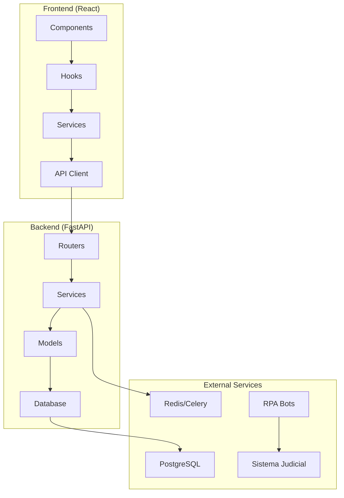

# 🔌 Arquitectura de API - LEXIA Backend & Frontend Integration

## 🎯 **Visión General**

Este documento define la arquitectura de API de LEXIA, incluyendo patrones de integración entre el backend FastAPI y el frontend React, manejo de autenticación, estados de carga, errores y optimizaciones de performance.

## 🏗️ **Arquitectura General**

### **Stack Tecnológico**


### **Flujo de Datos**
1. **Frontend**: Componente → Hook → Service → API Client
2. **Network**: HTTP Request (JSON + JWT)
3. **Backend**: Router → Service → Model → Database
4. **Response**: Database → Model → Service → Router → JSON
5. **Frontend**: API Client → Service → Hook → Component State

---

## 🔗 **Backend API Structure**

### **📁 Estructura de Directorios**
```
backend/app/
├── api/v1/                 # Versionado de API
├── core/                   # Configuración core
│   ├── config.py          # Settings centralizadas
│   ├── database.py        # Conexión a BD
│   └── security.py        # Autenticación JWT
├── routers/               # Endpoints organizados por dominio
│   ├── auth.py            # Autenticación de usuarios
│   ├── solicitudes.py     # CRUD de solicitudes
│   └── usuarios.py        # Gestión de usuarios
├── models/                # Modelos de base de datos
├── services/              # Lógica de negocio
├── utils/                 # Utilidades compartidas
└── dependencies.py        # Dependencias compartidas
```

### **🔐 Sistema de Autenticación**

#### **JWT Token Flow:**
```python
# backend/app/core/security.py
from jose import JWTError, jwt
from datetime import datetime, timedelta

def create_access_token(data: dict):
    to_encode = data.copy()
    expire = datetime.utcnow() + timedelta(minutes=ACCESS_TOKEN_EXPIRE_MINUTES)
    to_encode.update({"exp": expire})
    encoded_jwt = jwt.encode(to_encode, SECRET_KEY, algorithm=ALGORITHM)
    return encoded_jwt

def verify_token(token: str):
    try:
        payload = jwt.decode(token, SECRET_KEY, algorithms=[ALGORITHM])
        user_id: str = payload.get("sub")
        if user_id is None:
            return None
        return user_id
    except JWTError:
        return None
```

#### **Protected Routes Pattern:**
```python
# backend/app/dependencies.py
from fastapi import Depends, HTTPException, status
from fastapi.security import HTTPBearer

security = HTTPBearer()

async def get_current_user(
    token: str = Depends(security),
    db: Session = Depends(get_db)
) -> Usuario:
    user_id = verify_token(token.credentials)
    if not user_id:
        raise HTTPException(
            status_code=status.HTTP_401_UNAUTHORIZED,
            detail="Token inválido"
        )
    
    user = db.query(Usuario).filter(Usuario.id == user_id).first()
    if not user:
        raise HTTPException(
            status_code=status.HTTP_404_NOT_FOUND,
            detail="Usuario no encontrado"
        )
    
    return user
```

### **📊 API Response Patterns**

#### **Patrón de Respuesta Estándar:**
```python
# backend/app/routers/solicitudes.py
from pydantic import BaseModel
from typing import List, Optional
from datetime import datetime

class SolicitudResponse(BaseModel):
    id: str
    alias: str
    tipo_busqueda: str
    frecuencia_envio: str
    fecha_creacion: datetime
    activa: bool
    ultima_ejecucion: Optional[datetime] = None
    
    class Config:
        from_attributes = True

class PaginatedResponse(BaseModel):
    data: List[SolicitudResponse]
    total: int
    skip: int
    limit: int
    has_next: bool
    has_prev: bool

@router.get("/", response_model=List[SolicitudResponse])
async def get_solicitudes(
    skip: int = 0,
    limit: int = 100,
    current_user: Usuario = Depends(get_current_user),
    db: Session = Depends(get_db)
):
    solicitudes = db.query(SolicitudConsulta).filter(
        SolicitudConsulta.usuario_id == current_user.id
    ).offset(skip).limit(limit).all()
    
    return solicitudes
```

#### **Error Handling Pattern:**
```python
# backend/app/routers/solicitudes.py
from fastapi import HTTPException, status

@router.get("/{solicitud_id}")
async def get_solicitud(
    solicitud_id: str,
    current_user: Usuario = Depends(get_current_user),
    db: Session = Depends(get_db)
):
    solicitud = db.query(SolicitudConsulta).filter(
        SolicitudConsulta.id == solicitud_id,
        SolicitudConsulta.usuario_id == current_user.id
    ).first()
    
    if not solicitud:
        raise HTTPException(
            status_code=status.HTTP_404_NOT_FOUND,
            detail="Solicitud no encontrada"
        )
    
    return solicitud
```

---

## ⚛️ **Frontend API Integration**

### **🔧 API Client Base**

#### **Core API Service:**
```javascript
// src/services/api.js
const API_BASE_URL = 'http://localhost:8000'

export const apiRequest = async (endpoint, options = {}) => {
  const url = `${API_BASE_URL}${endpoint}`
  
  // Obtener token de autenticación
  let token = null
  try {
    token = localStorage.getItem('authToken')
  } catch (error) {
    console.log('No se pudo acceder a localStorage')
  }
  
  const config = {
    ...options,
    headers: {
      'Content-Type': 'application/json',
      ...(token && { Authorization: `Bearer ${token}` }),
      ...options.headers,
    },
  }

  try {
    const response = await fetch(url, config)
    
    if (!response.ok) {
      throw new Error(`HTTP error! status: ${response.status}`)
    }
    
    return response.json()
  } catch (error) {
    console.error('API Request failed:', error)
    throw error
  }
}
```

### **🎯 Domain-Specific Services**

#### **Solicitudes Service Pattern:**
```javascript
// src/services/solicitudes.js
import { apiRequest } from './api.js'

export const solicitudesService = {
  // GET: Obtener todas las solicitudes
  async getSolicitudes(params = {}) {
    const { skip = 0, limit = 100 } = params
    
    try {
      const response = await apiRequest(
        `/solicitudes/?skip=${skip}&limit=${limit}`,
        { method: 'GET' }
      )
      return response
    } catch (error) {
      console.warn('API no disponible, usando datos mock:', error.message)
      // Fallback graceful a datos mock
      return await mockSolicitudesService.getSolicitudes(params)
    }
  },

  // POST: Crear nueva solicitud
  async createSolicitud(solicitudData) {
    try {
      const response = await apiRequest('/solicitudes/', {
        method: 'POST',
        headers: { 'Content-Type': 'application/json' },
        body: JSON.stringify(solicitudData),
      })
      return response
    } catch (error) {
      console.warn('Create API no disponible, usando mock')
      return await mockSolicitudesService.createSolicitud(solicitudData)
    }
  },

  // PUT: Actualizar solicitud existente
  async updateSolicitud(solicitudId, updateData) {
    try {
      const response = await apiRequest(`/solicitudes/${solicitudId}`, {
        method: 'PUT',
        headers: { 'Content-Type': 'application/json' },
        body: JSON.stringify(updateData),
      })
      return response
    } catch (error) {
      console.warn('Update API no disponible, usando mock')
      return await mockSolicitudesService.updateSolicitud(solicitudId, updateData)
    }
  },

  // DELETE: Eliminar solicitud
  async deleteSolicitud(solicitudId) {
    try {
      const response = await apiRequest(`/solicitudes/${solicitudId}`, {
        method: 'DELETE',
      })
      return response
    } catch (error) {
      console.warn('Delete API no disponible, usando mock')
      return await mockSolicitudesService.deleteSolicitud(solicitudId)
    }
  }
}
```

### **🪝 React Query Integration**

#### **Custom Hooks con React Query:**
```javascript
// src/hooks/useSolicitudes.js
import { useQuery, useMutation, useQueryClient } from '@tanstack/react-query'
import { solicitudesService } from '../services/solicitudes'
import { useToast } from '../components/ui/Toast'

export function useSolicitudes(options = {}) {
  const {
    skip = 0,
    limit = 10,
    enableRealTime = false,
    pollingInterval = 30000,
    staleTime = 5 * 60 * 1000,    // 5 minutos
    cacheTime = 10 * 60 * 1000,   // 10 minutos
    retryCount = 3,
  } = options

  const queryClient = useQueryClient()
  const { toast } = useToast()

  // Query principal con React Query v5
  const {
    data: solicitudes = [],
    isLoading,
    isError,
    error,
    refetch,
    isFetching,
    isRefetching
  } = useQuery({
    queryKey: ['solicitudes', skip, limit],
    queryFn: async () => {
      try {
        const response = await solicitudesService.getSolicitudes({ skip, limit })
        return response || []
      } catch (error) {
        console.error('❌ Error en hook queryFn:', error)
        throw error
      }
    },
    staleTime,
    gcTime: cacheTime,  // React Query v5: gcTime reemplaza cacheTime
    retry: retryCount,
    refetchInterval: enableRealTime ? pollingInterval : false,
    placeholderData: [], // Datos iniciales mientras carga
    meta: {
      errorMessage: 'No se pudieron cargar las solicitudes'
    }
  })

  // Error handling automático
  useEffect(() => {
    if (isError && error) {
      console.error('❌ Error en query solicitudes:', error)
      toast?.error('Error', 'No se pudieron cargar las solicitudes')
    }
  }, [isError, error, toast])

  return {
    // Datos
    solicitudes: solicitudes || [],
    
    // Estados
    isLoading,
    isFetching,
    isRefetching,
    isError,
    error,
    
    // Funciones
    refetch,
    refreshSolicitudes: refetch,
    
    // Cache invalidation
    invalidateCache: () => {
      queryClient.invalidateQueries({ queryKey: ['solicitudes'] })
    }
  }
}
```

#### **Mutation Hooks Pattern:**
```javascript
// src/hooks/useSolicitudes.js
export function useCreateSolicitud() {
  const queryClient = useQueryClient()
  const { toast } = useToast()

  const createMutation = useMutation({
    mutationFn: async (solicitudData) => {
      return await solicitudesService.createSolicitud(solicitudData)
    },
    onSuccess: (data) => {
      // Invalidar cache automáticamente
      queryClient.invalidateQueries({ queryKey: ['solicitudes'] })
      toast?.success('Solicitud creada', 'La solicitud se ha creado exitosamente')
    },
    onError: (error) => {
      console.error('Error creando solicitud:', error)
      toast?.error('Error', 'No se pudo crear la solicitud')
    }
  })

  return {
    createSolicitud: createMutation.mutate,
    isCreating: createMutation.isPending,  // React Query v5: isPending
    createError: createMutation.error,
    createSuccess: createMutation.isSuccess
  }
}

export function useUpdateSolicitud() {
  const queryClient = useQueryClient()
  const { toast } = useToast()

  const updateMutation = useMutation({
    mutationFn: async ({ id, data }) => {
      return await solicitudesService.updateSolicitud(id, data)
    },
    onSuccess: (data, variables) => {
      // Optimistic Updates: Invalidar múltiples queries
      queryClient.invalidateQueries({ queryKey: ['solicitudes'] })
      queryClient.invalidateQueries({ queryKey: ['solicitud', variables.id] })
      toast?.success('Solicitud actualizada', 'Los cambios se han guardado')
    },
    onError: (error) => {
      console.error('Error actualizando solicitud:', error)
      toast?.error('Error', 'No se pudieron guardar los cambios')
    }
  })

  return {
    updateSolicitud: updateMutation.mutate,
    isUpdating: updateMutation.isPending,
    updateError: updateMutation.error
  }
}
```

---

## 🔐 **Authentication Flow**

### **Frontend Auth Management**

#### **Auth Context Pattern:**
```javascript
// src/contexts/AuthContext.js
import React, { createContext, useContext, useState, useEffect } from 'react'

const AuthContext = createContext(null)

export function AuthProvider({ children }) {
  const [user, setUser] = useState(null)
  const [isAuthenticated, setIsAuthenticated] = useState(false)
  const [isLoading, setIsLoading] = useState(true)

  // Verificar token al cargar la app
  useEffect(() => {
    const token = localStorage.getItem('authToken')
    if (token) {
      validateToken(token)
    } else {
      setIsLoading(false)
    }
  }, [])

  const validateToken = async (token) => {
    try {
      const response = await apiRequest('/auth/verify', {
        headers: { Authorization: `Bearer ${token}` }
      })
      
      setUser(response.user)
      setIsAuthenticated(true)
    } catch (error) {
      localStorage.removeItem('authToken')
      setUser(null)
      setIsAuthenticated(false)
    } finally {
      setIsLoading(false)
    }
  }

  const login = async (credentials) => {
    try {
      const response = await apiRequest('/auth/login', {
        method: 'POST',
        body: JSON.stringify(credentials)
      })
      
      localStorage.setItem('authToken', response.access_token)
      setUser(response.user)
      setIsAuthenticated(true)
      
      return { success: true }
    } catch (error) {
      return { success: false, error: error.message }
    }
  }

  const logout = () => {
    localStorage.removeItem('authToken')
    setUser(null)
    setIsAuthenticated(false)
  }

  const value = {
    user,
    isAuthenticated,
    isLoading,
    login,
    logout
  }

  return (
    <AuthContext.Provider value={value}>
      {children}
    </AuthContext.Provider>
  )
}

export const useAuth = () => {
  const context = useContext(AuthContext)
  if (!context) {
    throw new Error('useAuth must be used within AuthProvider')
  }
  return context
}
```

#### **Protected Routes Pattern:**
```javascript
// src/components/auth/ProtectedRoute.jsx
import { Navigate, useLocation } from 'react-router-dom'
import { useAuth } from '../../contexts/AuthContext'
import LoadingSpinner from '../ui/LoadingSpinner'

const ProtectedRoute = ({ children }) => {
  const { isAuthenticated, isLoading } = useAuth()
  const location = useLocation()

  if (isLoading) {
    return <LoadingSpinner />
  }

  if (!isAuthenticated) {
    return <Navigate to="/login" state={{ from: location }} replace />
  }

  return children
}

export default ProtectedRoute
```

---

## 📊 **Estado y Cache Management**

### **🔄 React Query Configuration**

#### **Query Client Setup:**
```javascript
// src/main.jsx
import { QueryClient, QueryClientProvider } from '@tanstack/react-query'
import { ReactQueryDevtools } from '@tanstack/react-query-devtools'

const queryClient = new QueryClient({
  defaultOptions: {
    queries: {
      staleTime: 5 * 60 * 1000,      // 5 minutos
      gcTime: 10 * 60 * 1000,        // 10 minutos (v5: gcTime)
      retry: (failureCount, error) => {
        // Retry logic personalizada
        if (error.status === 404) return false
        if (error.status >= 500) return failureCount < 2
        return failureCount < 3
      },
      refetchOnWindowFocus: false,
      refetchOnReconnect: true,
    },
    mutations: {
      retry: 1,
    },
  },
})

function App() {
  return (
    <QueryClientProvider client={queryClient}>
      <AuthProvider>
        <Router>
          <Routes>
            {/* App routes */}
          </Routes>
        </Router>
      </AuthProvider>
      <ReactQueryDevtools initialIsOpen={false} />
    </QueryClientProvider>
  )
}
```

### **💾 Optimistic Updates Pattern**

```javascript
// src/hooks/useSolicitudes.js
export function useOptimisticUpdateSolicitud() {
  const queryClient = useQueryClient()

  const updateMutation = useMutation({
    mutationFn: async ({ id, data }) => {
      return await solicitudesService.updateSolicitud(id, data)
    },
    
    // Optimistic update: Actualizar UI inmediatamente
    onMutate: async ({ id, data }) => {
      // Cancelar queries en vuelo
      await queryClient.cancelQueries({ queryKey: ['solicitudes'] })
      await queryClient.cancelQueries({ queryKey: ['solicitud', id] })

      // Snapshot del estado previo para rollback
      const previousSolicitudes = queryClient.getQueryData(['solicitudes'])
      const previousSolicitud = queryClient.getQueryData(['solicitud', id])

      // Optimistically update
      queryClient.setQueryData(['solicitudes'], (old) => {
        return old?.map(solicitud =>
          solicitud.id === id ? { ...solicitud, ...data } : solicitud
        ) || []
      })

      queryClient.setQueryData(['solicitud', id], (old) => {
        return old ? { ...old, ...data } : null
      })

      // Return context para rollback si falla
      return { previousSolicitudes, previousSolicitud }
    },

    // Rollback si falla
    onError: (err, variables, context) => {
      if (context?.previousSolicitudes) {
        queryClient.setQueryData(['solicitudes'], context.previousSolicitudes)
      }
      if (context?.previousSolicitud) {
        queryClient.setQueryData(['solicitud', variables.id], context.previousSolicitud)
      }
    },

    // Refetch en success para sincronizar con servidor
    onSettled: () => {
      queryClient.invalidateQueries({ queryKey: ['solicitudes'] })
    },
  })

  return updateMutation
}
```

---

## 🚨 **Error Handling Patterns**

### **🔧 Centralized Error Handler**

```javascript
// src/utils/errorHandler.js
export class APIError extends Error {
  constructor(message, status, code) {
    super(message)
    this.name = 'APIError'
    this.status = status
    this.code = code
  }
}

export const handleAPIError = (error) => {
  // Error de red
  if (!error.response) {
    return new APIError('Error de conexión', 0, 'NETWORK_ERROR')
  }

  // Errores HTTP
  switch (error.response.status) {
    case 400:
      return new APIError('Datos inválidos', 400, 'VALIDATION_ERROR')
    case 401:
      return new APIError('Token expirado', 401, 'AUTH_ERROR')
    case 403:
      return new APIError('Sin permisos', 403, 'PERMISSION_ERROR')
    case 404:
      return new APIError('Recurso no encontrado', 404, 'NOT_FOUND')
    case 500:
      return new APIError('Error del servidor', 500, 'SERVER_ERROR')
    default:
      return new APIError('Error desconocido', error.response.status, 'UNKNOWN_ERROR')
  }
}
```

#### **Global Error Boundary:**
```javascript
// src/components/ui/ErrorBoundary.jsx
import React from 'react'

class ErrorBoundary extends React.Component {
  constructor(props) {
    super(props)
    this.state = { hasError: false, error: null }
  }

  static getDerivedStateFromError(error) {
    return { hasError: true, error }
  }

  componentDidCatch(error, errorInfo) {
    console.error('Error Boundary caught an error:', error, errorInfo)
    
    // Enviar error a servicio de monitoreo
    // sendErrorToMonitoring(error, errorInfo)
  }

  render() {
    if (this.state.hasError) {
      return this.props.fallback || (
        <div className="min-h-screen flex items-center justify-center bg-bg-light">
          <div className="text-center space-y-md">
            <h2 className="text-heading-h2 font-heading text-text-primary">
              Algo salió mal
            </h2>
            <p className="text-body-paragraph text-text-secondary">
              Ha ocurrido un error inesperado. Por favor, recarga la página.
            </p>
            <Button 
              variant="primary" 
              onClick={() => window.location.reload()}
            >
              Recargar Página
            </Button>
          </div>
        </div>
      )
    }

    return this.props.children
  }
}

export default ErrorBoundary
```

### **🎯 Component-Level Error Handling**

```javascript
// src/hooks/useErrorHandler.js
import { useCallback } from 'react'
import { useToast } from '../components/ui/Toast'
import { handleAPIError } from '../utils/errorHandler'

export function useErrorHandler() {
  const { toast } = useToast()

  const handleError = useCallback((error, context = '') => {
    const apiError = handleAPIError(error)
    
    console.error(`Error in ${context}:`, apiError)
    
    // Toast notification based on error type
    switch (apiError.code) {
      case 'AUTH_ERROR':
        toast.error('Sesión Expirada', 'Por favor, inicia sesión nuevamente')
        // Redirigir a login
        break
      case 'VALIDATION_ERROR':
        toast.error('Datos Inválidos', apiError.message)
        break
      case 'NETWORK_ERROR':
        toast.error('Sin Conexión', 'Verifica tu conexión a internet')
        break
      default:
        toast.error('Error', apiError.message)
    }
    
    return apiError
  }, [toast])

  return { handleError }
}
```

---

## ⚡ **Performance Optimizations**

### **🔄 Real-time Updates**

#### **WebSocket Integration Pattern:**
```javascript
// src/hooks/useRealTimeUpdates.js
import { useEffect, useRef } from 'react'
import { useQueryClient } from '@tanstack/react-query'

export function useRealTimeUpdates(userId) {
  const queryClient = useQueryClient()
  const wsRef = useRef(null)

  useEffect(() => {
    if (!userId) return

    // Conectar WebSocket
    wsRef.current = new WebSocket(`ws://localhost:8000/ws/${userId}`)

    wsRef.current.onmessage = (event) => {
      const data = JSON.parse(event.data)

      switch (data.type) {
        case 'solicitud_updated':
          // Invalidar cache de solicitudes
          queryClient.invalidateQueries({ queryKey: ['solicitudes'] })
          queryClient.invalidateQueries({ queryKey: ['solicitud', data.solicitud_id] })
          break
          
        case 'execution_progress':
          // Actualizar progreso de ejecución
          queryClient.setQueryData(['execution', data.solicitud_id], data.progress)
          break
          
        case 'new_result':
          // Notificar nuevo resultado
          queryClient.invalidateQueries({ queryKey: ['historial'] })
          break
      }
    }

    wsRef.current.onerror = (error) => {
      console.error('WebSocket error:', error)
    }

    // Cleanup
    return () => {
      if (wsRef.current) {
        wsRef.current.close()
      }
    }
  }, [userId, queryClient])

  return wsRef.current?.readyState === WebSocket.OPEN
}
```

### **📦 Code Splitting & Lazy Loading**

```javascript
// src/App.jsx
import { Suspense, lazy } from 'react'
import LoadingSpinner from './components/ui/LoadingSpinner'

// Lazy load de páginas
const Dashboard = lazy(() => import('./pages/Dashboard'))
const Solicitudes = lazy(() => import('./pages/Solicitudes'))
const Historial = lazy(() => import('./pages/Historial'))

function App() {
  return (
    <Router>
      <Routes>
        <Route path="/" element={
          <Suspense fallback={<LoadingSpinner />}>
            <Dashboard />
          </Suspense>
        } />
        <Route path="/solicitudes" element={
          <Suspense fallback={<LoadingSpinner />}>
            <Solicitudes />
          </Suspense>
        } />
        <Route path="/historial" element={
          <Suspense fallback={<LoadingSpinner />}>
            <Historial />
          </Suspense>
        } />
      </Routes>
    </Router>
  )
}
```

### **🎯 Query Optimization**

```javascript
// src/hooks/useSolicitudesOptimized.js
export function useSolicitudesOptimized(options = {}) {
  const { enableBackground = true, prefetchNext = true } = options
  const queryClient = useQueryClient()

  const solicitudesQuery = useQuery({
    queryKey: ['solicitudes', options.filters],
    queryFn: () => solicitudesService.getSolicitudes(options.filters),
    
    // Background refetch para datos frescos
    refetchOnMount: enableBackground,
    refetchOnWindowFocus: enableBackground,
    refetchInterval: enableBackground ? 30000 : false,
    
    // Stale while revalidate
    staleTime: 2 * 60 * 1000,  // 2 minutos
    gcTime: 5 * 60 * 1000,     // 5 minutos
  })

  // Prefetch de la siguiente página
  useEffect(() => {
    if (prefetchNext && solicitudesQuery.data?.hasNext) {
      const nextPageFilters = {
        ...options.filters,
        skip: (options.filters.skip || 0) + (options.filters.limit || 10)
      }
      
      queryClient.prefetchQuery({
        queryKey: ['solicitudes', nextPageFilters],
        queryFn: () => solicitudesService.getSolicitudes(nextPageFilters),
        staleTime: 1 * 60 * 1000  // 1 minuto para prefetch
      })
    }
  }, [solicitudesQuery.data, options.filters, prefetchNext, queryClient])

  return solicitudesQuery
}
```

---

## 🧪 **Testing API Integration**

### **🎭 API Mocking para Tests**

```javascript
// src/tests/mocks/apiMocks.js
import { http, HttpResponse } from 'msw'

export const handlers = [
  // GET solicitudes
  http.get('/solicitudes', ({ request }) => {
    const url = new URL(request.url)
    const skip = url.searchParams.get('skip') || 0
    const limit = url.searchParams.get('limit') || 10

    return HttpResponse.json({
      data: mockSolicitudes.slice(skip, skip + limit),
      total: mockSolicitudes.length,
      skip: parseInt(skip),
      limit: parseInt(limit)
    })
  }),

  // POST solicitud
  http.post('/solicitudes', async ({ request }) => {
    const newSolicitud = await request.json()
    const solicitud = {
      id: `mock-${Date.now()}`,
      ...newSolicitud,
      fecha_creacion: new Date().toISOString(),
      activa: true
    }
    
    return HttpResponse.json(solicitud, { status: 201 })
  }),

  // Error scenarios
  http.get('/solicitudes/error', () => {
    return HttpResponse.json(
      { detail: 'Server error' },
      { status: 500 }
    )
  })
]
```

#### **Hook Testing Pattern:**
```javascript
// src/hooks/__tests__/useSolicitudes.test.js
import { renderHook, waitFor } from '@testing-library/react'
import { QueryClient, QueryClientProvider } from '@tanstack/react-query'
import { useSolicitudes } from '../useSolicitudes'

const createWrapper = () => {
  const queryClient = new QueryClient({
    defaultOptions: {
      queries: { retry: false },
      mutations: { retry: false },
    },
  })
  
  return ({ children }) => (
    <QueryClientProvider client={queryClient}>
      {children}
    </QueryClientProvider>
  )
}

describe('useSolicitudes', () => {
  it('should fetch solicitudes successfully', async () => {
    const { result } = renderHook(() => useSolicitudes(), {
      wrapper: createWrapper(),
    })

    expect(result.current.isLoading).toBe(true)

    await waitFor(() => {
      expect(result.current.isLoading).toBe(false)
    })

    expect(result.current.solicitudes).toEqual(
      expect.arrayContaining([
        expect.objectContaining({
          id: expect.any(String),
          alias: expect.any(String),
        })
      ])
    )
  })

  it('should handle errors gracefully', async () => {
    // Mock error response
    const { result } = renderHook(() => useSolicitudes(), {
      wrapper: createWrapper(),
    })

    await waitFor(() => {
      expect(result.current.isError).toBe(true)
    })

    expect(result.current.error).toBeDefined()
  })
})
```

---

## 🔧 **Development Tools**

### **📊 API Monitoring & Debugging**

#### **Request/Response Interceptor:**
```javascript
// src/utils/apiLogger.js
const isDevelopment = import.meta.env.DEV

export const logAPIRequest = (url, options) => {
  if (!isDevelopment) return

  console.group(`🔄 API Request: ${options.method || 'GET'} ${url}`)
  console.log('Options:', options)
  console.log('Timestamp:', new Date().toISOString())
  console.groupEnd()
}

export const logAPIResponse = (url, response, duration) => {
  if (!isDevelopment) return

  const status = response.status
  const statusColor = status >= 400 ? '🔴' : status >= 300 ? '🟡' : '🟢'

  console.group(`${statusColor} API Response: ${status} ${url} (${duration}ms)`)
  console.log('Response:', response)
  console.log('Duration:', `${duration}ms`)
  console.groupEnd()
}

// Integrar en apiRequest
export const apiRequest = async (endpoint, options = {}) => {
  const startTime = performance.now()
  
  logAPIRequest(endpoint, options)
  
  try {
    const response = await fetch(`${API_BASE_URL}${endpoint}`, config)
    const duration = Math.round(performance.now() - startTime)
    
    logAPIResponse(endpoint, response, duration)
    
    return response.json()
  } catch (error) {
    const duration = Math.round(performance.now() - startTime)
    console.error(`❌ API Error: ${endpoint} (${duration}ms)`, error)
    throw error
  }
}
```

#### **React Query DevTools:**
```javascript
// src/main.jsx
import { ReactQueryDevtools } from '@tanstack/react-query-devtools'

function App() {
  return (
    <QueryClientProvider client={queryClient}>
      {/* App content */}
      
      {/* DevTools solo en desarrollo */}
      {import.meta.env.DEV && (
        <ReactQueryDevtools 
          initialIsOpen={false}
          position="bottom-right"
        />
      )}
    </QueryClientProvider>
  )
}
```

---

## 🎯 **Best Practices Summary**

### **✅ DO - Mejores Prácticas**

#### **🔐 Seguridad**
✅ **Usar JWT tokens** para autenticación
✅ **Validar tokens en cada request** protegido
✅ **Sanitizar inputs** en frontend y backend
✅ **Implementar rate limiting** en API endpoints
✅ **Usar HTTPS** en producción
✅ **No exponer secrets** en código frontend

#### **📊 Estado y Cache**
✅ **Usar React Query** para server state management
✅ **Implementar optimistic updates** para mejor UX
✅ **Configurar cache strategies** apropiadas
✅ **Invalidar cache** cuando sea necesario
✅ **Prefetch datos** para mejorar performance

#### **🚨 Error Handling**
✅ **Implementar fallback strategies** (mock data)
✅ **Manejar errores de red** gracefully
✅ **Mostrar loading states** apropiados
✅ **Proveer feedback** al usuario
✅ **Logear errores** para debugging

#### **⚡ Performance**
✅ **Implementar code splitting** para páginas
✅ **Lazy load componentes** pesados
✅ **Optimizar queries** con staleTime
✅ **Usar WebSockets** para real-time updates
✅ **Implementar pagination** para listas grandes

### **❌ DON'T - Evitar**

❌ **No hardcodear URLs** de API
```javascript
// ❌ Incorrecto
const response = await fetch('http://localhost:8000/solicitudes')

// ✅ Correcto
const response = await apiRequest('/solicitudes')
```

❌ **No ignorar estados de error**
```javascript
// ❌ Incorrecto
const { data } = useQuery(['solicitudes'], fetchSolicitudes)
return <div>{data.map(...)}</div>

// ✅ Correcto
const { data, isLoading, error } = useQuery(['solicitudes'], fetchSolicitudes)
if (isLoading) return <LoadingSpinner />
if (error) return <ErrorState error={error} />
return <div>{data?.map(...) || []}</div>
```

❌ **No fetch datos en componentes**
```javascript
// ❌ Incorrecto: fetch directo en componente
const Component = () => {
  const [data, setData] = useState([])
  
  useEffect(() => {
    fetch('/api/data').then(res => res.json()).then(setData)
  }, [])
  
  return <div>{data.map(...)}</div>
}

// ✅ Correcto: usar hooks especializados
const Component = () => {
  const { data, isLoading, error } = useSolicitudes()
  
  if (isLoading) return <LoadingSpinner />
  if (error) return <ErrorState error={error} />
  
  return <div>{data.map(...)}</div>
}
```

❌ **No bloquear UI durante operaciones**
```javascript
// ❌ Incorrecto: no mostrar estado de loading
const handleSubmit = async (data) => {
  await createSolicitud(data)
  navigate('/solicitudes')
}

// ✅ Correcto: mostrar loading state
const { createSolicitud, isCreating } = useCreateSolicitud()

const handleSubmit = async (data) => {
  await createSolicitud(data)
  navigate('/solicitudes')
}

return (
  <Button 
    onClick={handleSubmit} 
    loading={isCreating}
    disabled={isCreating}
  >
    {isCreating ? 'Creando...' : 'Crear Solicitud'}
  </Button>
)
```

---

## 📚 **Recursos Adicionales**

- [🎨 Component Patterns](./component-patterns.md) - Patrones de componentes UI
- [🧪 Testing Strategy](../testing/strategy.md) - Estrategias de testing
- [🚢 Deployment Guide](../deployment/overview.md) - Deployment y DevOps
- [FastAPI Documentation](https://fastapi.tiangolo.com/) - Documentación oficial de FastAPI
- [React Query Documentation](https://tanstack.com/query/latest) - React Query v5
- [Pydantic Documentation](https://docs.pydantic.dev/) - Validación de datos

**Código fuente**: `src/services/`, `src/hooks/`, `backend/app/`  
**Última actualización**: Enero 2025  
**Versión**: 1.0.0  
**Mantenido por**: Equipo Full-Stack