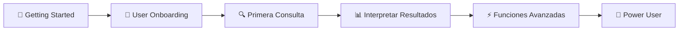
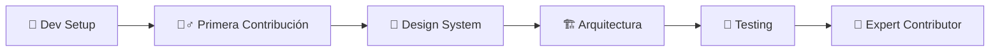
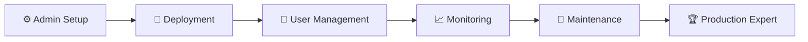

# 🚀 Comenzar con LEXIA

<div align="center">
  
  
  **Tu punto de partida para dominar LEXIA**
  
  *Guías paso a paso para cada tipo de usuario*
</div>

---

## 🎯 **Elige tu Camino**

<table>
<tr>
<td width="50%" valign="top">

### 👩‍💻 **Para Desarrolladores**

**¿Vas a contribuir al código o integrar LEXIA?**

#### 🚀 **Setup Rápido (5 minutos)**
1. **[🔧 Development Setup](./development-setup.md)**
   - Instalación completa del entorno
   - Variables de entorno
   - Primera ejecución

2. **[🏃‍♂️ Primera Contribución](./first-contribution.md)**
   - Proceso de contribución
   - Standards de código
   - Pull Request workflow

3. **[🎨 Usando el Design System](./design-system-usage.md)**
   - Componentes disponibles
   - Patrones de implementación
   - Best practices

#### 📚 **Próximos Pasos**
- [🏗️ Arquitectura](../architecture/overview.md)
- [🔧 Development Guidelines](../development/overview.md)
- [🧪 Testing Strategy](../testing/strategy.md)

</td>
<td width="50%" valign="top">

### 👥 **Para Usuarios Finales**

**¿Vas a usar LEXIA para consultas judiciales?**

#### 📱 **Onboarding Rápido (10 minutos)**
1. **[📱 Primeros Pasos](./user-onboarding.md)**
   - Crear cuenta
   - Configurar perfil
   - Navegación básica

2. **[🔍 Primera Consulta](./first-query.md)**
   - Consulta simple paso a paso
   - Interpretar resultados
   - Guardar y exportar

3. **[📊 Dashboard Overview](./dashboard-intro.md)**
   - Métricas principales
   - Historial de consultas
   - Configuraciones

#### 📚 **Próximos Pasos**
- [👥 User Guides Completas](../user-guides/overview.md)
- [📈 Ejemplos Prácticos](../examples/tutorials/)
- [❓ FAQ Usuarios](../user-guides/faq.md)

</td>
</tr>
<tr>
<td colspan="2">

### 🏢 **Para Administradores y DevOps**

**¿Vas a configurar, desplegar o mantener LEXIA?**

#### ⚙️ **Setup Empresarial**
1. **[⚙️ Configuración Inicial](./admin-setup.md)**
   - Infraestructura requerida
   - Configuración de servicios
   - Variables de entorno empresariales

2. **[👥 Gestión de Usuarios](./user-management.md)**
   - Roles y permisos
   - Autenticación empresarial
   - Políticas de seguridad

3. **[🚢 Deployment](./deployment-intro.md)**
   - Opciones de despliegue
   - Docker vs Cloud
   - CI/CD setup

4. **[📈 Monitoreo](./monitoring-intro.md)**
   - Métricas clave
   - Alertas automáticas
   - Logs y troubleshooting

#### 📚 **Próximos Pasos**
- [🚢 Deployment Completo](../deployment/overview.md)
- [🔄 Maintenance](../maintenance/overview.md)
- [📚 Reference](../reference/overview.md)

</td>
</tr>
</table>

---

## ⚡ **Quick Start Universal**

### **🐳 Opción 1: Docker (Recomendado)**
```bash
# Clonar repositorio
git clone https://github.com/tu-org/lexia.git
cd lexia

# Configurar environment
cp .env.example .env
# Editar .env con tus configuraciones

# Iniciar todos los servicios
docker-compose up -d

# Verificar que todo funciona
curl http://localhost:8000/health
# ✅ Expected: {"status": "healthy"}
```

**Servicios disponibles:**
- 🌐 **Frontend**: http://localhost:3000
- ⚡ **API**: http://localhost:8000
- 📖 **API Docs**: http://localhost:8000/docs
- 🗄️ **Database**: localhost:5432

### **🔧 Opción 2: Desarrollo Local**
```bash
# Backend
cd backend
python -m venv venv
source venv/bin/activate  # Windows: venv\Scripts\activate
pip install -r requirements.txt
uvicorn app.main:app --reload

# Frontend (nueva terminal)
cd frontend
npm install
npm run dev
```

---

## 🎯 **Verificación de Setup**

### **✅ Checklist de Verificación**

#### **Backend Working**
- [ ] ✅ `curl http://localhost:8000/health` responde `{"status": "healthy"}`
- [ ] ✅ API docs accesibles en `http://localhost:8000/docs`
- [ ] ✅ Database conecta correctamente

#### **Frontend Working**
- [ ] ✅ App carga en `http://localhost:3000`
- [ ] ✅ Login/registro funciona
- [ ] ✅ Dashboard muestra datos

#### **Integration Working**
- [ ] ✅ Frontend conecta con Backend
- [ ] ✅ Autenticación funciona end-to-end
- [ ] ✅ Primera consulta se ejecuta correctamente

### **🚨 ¿Problemas?**
- **🔧 Issues técnicos**: [Troubleshooting Guide](../troubleshooting/common-issues.md)
- **🐛 Bugs encontrados**: [Reportar Bug](https://github.com/tu-org/lexia/issues/new?template=bug)
- **💬 Preguntas**: [Discussions](https://github.com/tu-org/lexia/discussions)

---

## 🎓 **Flujos de Aprendizaje Recomendados**

### **🔰 Usuario Nuevo (First Time)**


### **👩‍💻 Developer Journey**


### **🏢 Admin/DevOps Journey**


---

## 🎯 **Objetivos de Aprendizaje**

### **🎯 Después de Getting Started deberías poder:**

#### **👥 Como Usuario**
- ✅ Ejecutar tu primera consulta judicial exitosamente
- ✅ Navegar el dashboard e interpretar métricas
- ✅ Exportar resultados en diferentes formatos
- ✅ Configurar alertas y notificaciones básicas

#### **👩‍💻 Como Developer**
- ✅ Ejecutar LEXIA localmente sin errores
- ✅ Crear un componente siguiendo el design system
- ✅ Hacer tu primera contribución via Pull Request
- ✅ Ejecutar tests y entender la arquitectura básica

#### **🏢 Como Admin/DevOps**
- ✅ Desplegar LEXIA en ambiente de staging
- ✅ Configurar usuarios y roles correctamente
- ✅ Monitorear la aplicación y interpretar métricas
- ✅ Realizar backup y restore de datos

---

## 📊 **Métricas de Éxito**

Medimos el éxito de nuestro onboarding con:

- ⏱️ **Tiempo promedio**: <30 minutos para completar setup
- 🎯 **Tasa de éxito**: >90% completan primera tarea
- 📈 **Satisfacción**: >4.5/5 en survey post-onboarding
- 🔄 **Retención**: >80% usuarios activos después de 7 días

---

## 🆘 **¿Necesitas Ayuda?**

### **🚀 Canales de Soporte Rápido**
- **💬 Chat en tiempo real**: [Discord](https://discord.gg/lexia)
- **📧 Email soporte**: onboarding@lexia.co
- **📞 Llamada urgente**: +57 (1) 234-5678
- **🎥 Video llamada**: [Calendly](https://calendly.com/lexia-onboarding)

### **📚 Recursos Adicionales**
- **🎥 Videos tutoriales**: [YouTube Channel](https://youtube.com/lexia)
- **📖 Knowledge Base**: [help.lexia.co](https://help.lexia.co)
- **👥 Community Forum**: [community.lexia.co](https://community.lexia.co)

---

<div align="center">

**🎯 ¿Completaste el Getting Started?**

[](../user-guides/overview.md)
[](../development/overview.md)
[](../architecture/overview.md)

---

<sub>📝 **¿Mejoras a esta guía?** [Editar en GitHub](https://github.com/lexia/lexia/edit/main/docs/getting-started/index.md)</sub><br/>
<sub>⭐ **¿Te ayudó?** ¡Déjanos una estrella en GitHub!</sub>

</div>