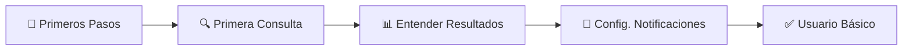
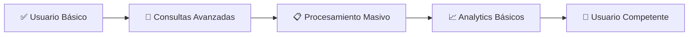
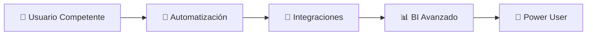

# 👥 User Guides - LEXIA

<div align="center">
  
  **Guías completas para usuarios finales de LEXIA**
  
  *Todo lo que necesitas saber para usar LEXIA efectivamente*

</div>

---

## 🎯 **Guías por Nivel de Experiencia**

### **🔰 Nivel Principiante**

| Guía | Tiempo | Descripción |
|------|--------|-------------|
| [👋 Primeros Pasos](./getting-started.md) | 10 min | Tu primera consulta y navegación básica |
| [🔍 Primera Consulta](./first-query.md) | 5 min | Paso a paso para tu primera consulta exitosa |
| [📊 Entender Resultados](./understanding-results.md) | 15 min | Cómo interpretar la información obtenida |
| [🔔 Configurar Notificaciones](./notifications-setup.md) | 5 min | Email, SMS y alertas personalizadas |

### **⚡ Nivel Intermedio**

| Guía | Tiempo | Descripción |
|------|--------|-------------|
| [🎯 Consultas Avanzadas](./advanced-queries.md) | 20 min | Filtros múltiples y búsquedas complejas |
| [📋 Procesamiento Masivo](./bulk-processing.md) | 15 min | Consultar múltiples radicados con Excel/CSV |
| [📈 Analytics y Reportes](./analytics-reports.md) | 25 min | Dashboard, métricas y reportes automáticos |
| [⚙️ Personalización](./customization.md) | 10 min | Configurar LEXIA según tu flujo de trabajo |

### **🚀 Nivel Avanzado**

| Guía | Tiempo | Descripción |
|------|--------|-------------|
| [🔄 Automatización](./automation.md) | 30 min | Consultas programadas y workflows |
| [🔗 Integraciones](./integrations.md) | 45 min | Webhooks, API y sistemas externos |
| [🎛️ Administración](./administration.md) | 20 min | Gestión de usuarios y configuración empresarial |
| [📊 Business Intelligence](./business-intelligence.md) | 35 min | Análisis avanzado y toma de decisiones |

---

## 📚 **Guías por Caso de Uso**

### **⚖️ Por Área de Derecho**

<div align="center">

| 👔 **Derecho Laboral** | 🏢 **Derecho Civil** | 💼 **Derecho Comercial** | 🏛️ **Derecho Administrativo** |
|----------------------|---------------------|-------------------------|----------------------------|
| • Demandas laborales<br/>• Tutelas de trabajo<br/>• Procesos disciplinarios | • Procesos civiles<br/>• Sucesiones<br/>• Familia y divorcio | • Procesos ejecutivos<br/>• Sociedades<br/>• Insolvencia | • Contencioso admin<br/>• Contratación estatal<br/>• Sanciones |

</div>

### **🏢 Por Tipo de Práctica**

<table>
<tr>
<td width="33%" align="center">

### **🏠 Práctica Individual**
- [Configuración básica](./setup-individual.md)
- [Gestión de casos personales](./personal-case-management.md)
- [Reportes para clientes](./client-reports.md)

</td>
<td width="33%" align="center">

### **👥 Firma Mediana**
- [Setup multi-usuario](./setup-firm.md)
- [Colaboración en equipo](./team-collaboration.md)
- [Gestión de clientes](./client-management.md)

</td>
<td width="33%" align="center">

### **🏢 Firma Grande**
- [Configuración empresarial](./enterprise-setup.md)
- [Integración con sistemas](./system-integration.md)
- [Analytics empresariales](./enterprise-analytics.md)

</td>
</tr>
</table>

---

## 🔧 **Herramientas y Recursos**

### **📖 Referencias Rápidas**

| Herramienta | Descripción | Link |
|-------------|-------------|------|
| **🎯 Cheat Sheet** | Comandos y accesos rápidos | [Ver](./cheat-sheet.md) |
| **📋 Templates** | Plantillas para consultas comunes | [Descargar](./templates/) |
| **🔍 Glosario** | Términos técnicos y legales | [Ver](./glossary.md) |
| **❓ FAQ** | Preguntas frecuentes | [Ver](./faq.md) |

### **🎥 Contenido Multimedia**

- **📺 Video Tutoriales**: [YouTube Playlist](https://youtube.com/playlist?list=lexia-tutorials)
- **🎙️ Webinars**: [Calendario de eventos](https://lexia.co/webinars)
- **📱 App móvil**: [iOS](https://apps.apple.com/lexia) | [Android](https://play.google.com/store/apps/lexia)

---

## 🆘 **Soporte y Ayuda**

### **🚀 Opciones de Soporte**

<div align="center">

| Tipo | Disponibilidad | Mejor Para | Contacto |
|------|---------------|------------|----------|
| **💬 Chat en Vivo** | Lun-Vie 8AM-6PM | Dudas rápidas | En app.lexia.co |
| **📧 Email** | 24/7 (respuesta <24h) | Consultas detalladas | soporte@lexia.co |
| **📞 Teléfono** | Lun-Vie 8AM-6PM | Urgencias | +57 (1) 234-5678 |
| **🎥 Video Llamada** | Cita previa | Training personalizado | [Agendar](https://calendly.com/lexia) |

</div>

### **📚 Recursos de Aprendizaje**

- **🎓 LEXIA Academy**: [academy.lexia.co](https://academy.lexia.co)
- **👥 Community Forum**: [community.lexia.co](https://community.lexia.co)
- **📖 Knowledge Base**: [help.lexia.co](https://help.lexia.co)
- **💡 Feature Requests**: [feedback.lexia.co](https://feedback.lexia.co)

---

## 🎯 **Flujos de Aprendizaje Recomendados**

### **🔰 Usuario Nuevo (Primera Semana)**



**Tiempo total**: ~35 minutos  
**Meta**: Realizar consultas básicas exitosamente

### **⚡ Usuario Intermedio (Primera Mes)**



**Tiempo total**: ~60 minutos  
**Meta**: Usar todas las funciones principales

### **🚀 Usuario Avanzado (Segundo Mes)**



**Tiempo total**: ~110 minutos  
**Meta**: Maximizar eficiencia y ROI

---

## 📊 **Métricas de Éxito**

### **🎯 KPIs de Usuario**

Medimos tu progreso con:

- **⏱️ Tiempo de primera consulta**: <10 minutos
- **🎯 Tasa de éxito**: >95% consultas exitosas
- **📈 Productividad**: 10x más rápido que métodos manuales
- **😊 Satisfacción**: >4.5/5 en surveys

### **📈 Evolución Típica de Usuario**

```
Semana 1: 📈 5-10 consultas/día
Semana 2: 📈 15-25 consultas/día  
Mes 1: 📈 30-50 consultas/día
Mes 3: 📈 50+ consultas/día + automatización
```

---

## 🔄 **Actualizaciones y Novedades**

### **📢 Cómo Mantenerse Actualizado**

- **📧 Newsletter mensual**: Nuevas funciones y tips
- **🔔 Notificaciones in-app**: Actualizaciones importantes
- **📱 Redes sociales**: [Twitter](https://twitter.com/lexia) | [LinkedIn](https://linkedin.com/company/lexia)
- **📝 Release Notes**: [changelog.lexia.co](https://changelog.lexia.co)

### **🚀 Próximas Funciones (Q2 2025)**

- **📱 App móvil**: iOS y Android nativo
- **🤖 IA Predictiva**: Predicción de resultados de casos
- **🔗 Más integraciones**: ERP legales, CRM
- **📊 Analytics avanzados**: Machine Learning insights

---

<div align="center">

**👥 ¿Qué tipo de usuario eres?**

[](./getting-started.md)
[](./advanced-queries.md)
[](./automation.md)

---

<sub>📝 **¿Falta alguna guía?** [Solicitar nueva guía](https://github.com/lexia/lexia/issues/new?template=docs-request)</sub><br/>
<sub>⭐ **¿Útil?** ¡Comparte estas guías con tu equipo jurídico!</sub><br/>
<sub>🔄 **Última actualización:** Enero 2025 | **Mantenido por:** Customer Success Team</sub>

</div>